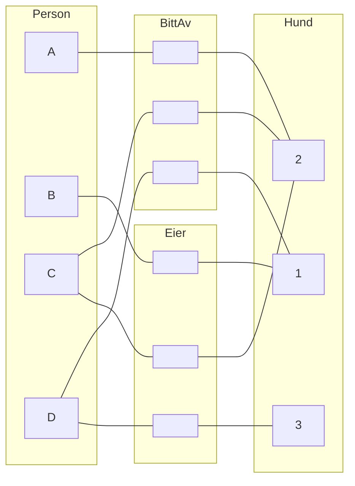

# TDT4145 - Data Modelling, Databases and Database Management Systems

## Video-1-intro-ER-modellering

### Oversikt: Datamodellering med ER-modeller
- Dataelementer
  - Entiteter
  - Relasjoner
  - Attributter
- Entitetsklasser
  - Svake entitetsklasser
  - Rekursive entitetsklasser
- Relasjonsklasser
  - 1:1-relasjoner
  - 1:N-relasjoner
  - N:N-relasjoner
  - Antall "deltakerklasser" (grad)
- Restriksjoner
  - Datatyper
  - Nøkler
  - Strukturelle restriksjoner
- Modelleringsprosess
- ER-diagram
- Forekomstdiagram
- Spesialisering/generalisering
- Kategorier
- Mapping til relasjonsdatabase-modell

### Entiteter
- Entitet - objekt eller "noe" som eksisterer i mini-verdenen.
- Beskriver egenskaper ved entiteter ved hjelp av attributter.
- Attributt henter sine mulige verdier fra et domene (datatype).
- Ulike typer attributter
  - Enkle, sammensatte
  - En eller flere verdier
  - Avledet (ved hjelp av en regel)
  - Nøkkelattributter (entydige identifikatorer)

### Entitetsklasse
- Mengden av alle likeartede entiteter som er av samme klasse (type) og har samme egenskaper
- 

### Relasjoner
- Relasjon - sammenheng (assosiasjon) mellom to eller flere enititeter.
- Modellerer informasjon som viser en sammenheng mellom to eller flere entiteter:
  - "En student har tatt eksamen i et emne"
  - "En person eier en bil"
- Kan ha egenskaper på samme måte som entiteter, altså egne attributter.
  - "Karakterern som en student fikk på eksamen i et emne"
- Relasjonen eksisterer ikke uten de entitetene som deltar.

### Relasjonsklasser (-typer)
- Mengden av likeartede relasjoner mellom samme enitetsklasser

### Forekomstdiagram
Som mengder:
$$
\begin{align*}
    \text{Person} &= \{A, B, C, D\} \\
    \text{Hund} &= \{1, 2, 3\} \\
    \text{Eier} &= \{(B, 1), (D, 3), (C, 2)\} \\
    \text{BittAv} &= \{(D, 1), (C, 2), (A, 2)\}
\end{align*}
$$
Som forekomstdiagram:

### Trinn i utvikling av datamodell
1. Finn de nødvendige entitetsklassene
2. Finn attributtene for entitetsklassene
3. Finn de nødvendige relasjonsklassene
4. Finn attributtene for relasjonsklassene
5. Bestem nøkler for entitetsklassene
6. Bestem restriksjoner for relasjonsklassene
7. Vurder om du har en god modell, gjør evt. nødvendige endringer

### Oppgave: Enkel fotodatabase
1. Entitetsklasser
   - Fotografi
   - Fotograf
   - Motiv
2. Attributter for entiteter
   - Fotografi
     - identifikator
     - tittel
     - dato
   - Fotograf
     - identifikator
     - navn
     - nasjonalitet
   - Motiv
     - identifikator
     - beskrivelse
3. Relasjonsklasser
   - Fotograf har tatt et fotografi
   - Et fotografi viser et motiv
4. ?
5. ?
6. Restriksjoner
   - Fotograf (0, N) harTatt (0, 1) fotografi
   - Fotografi (0, N) viser (0, N) motiv

ER-diagrammet blir da som følger:

