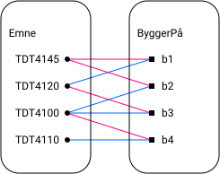

# TDT4145 - Data Modelling, Databases and Database Management Systems

  
Videoer

## Video-1-intro-ER-modellering

### Oversikt: Datamodellering med ER-modeller
- Dataelementer
  - Entiteter
  - Relasjoner
  - Attributter
- Entitetsklasser
  - Svake entitetsklasser
  - Rekursive entitetsklasser
- Relasjonsklasser
  - 1:1-relasjoner
  - 1:N-relasjoner
  - N:N-relasjoner
  - Antall "deltakerklasser" (grad)
- Restriksjoner
  - Datatyper
  - Nøkler
  - Strukturelle restriksjoner
- Modelleringsprosess
- ER-diagram
- Forekomstdiagram
- Spesialisering/generalisering
- Kategorier
- Mapping til relasjonsdatabase-modell

### Entiteter
- Entitet - objekt eller "noe" som eksisterer i mini-verdenen.
- Beskriver egenskaper ved entiteter ved hjelp av attributter.
- Attributt henter sine mulige verdier fra et domene (datatype).
- Ulike typer attributter
  - Enkle, sammensatte
  - En eller flere verdier
  - Avledet (ved hjelp av en regel)
  - Nøkkelattributter (entydige identifikatorer)

### Entitetsklasse
- Mengden av alle likeartede entiteter som er av samme klasse (type) og har samme egenskaper

Eksempel i ER-diagram:

### Relasjoner
- Relasjon - sammenheng (assosiasjon) mellom to eller flere enititeter.
- Modellerer informasjon som viser en sammenheng mellom to eller flere entiteter:
  - "En student har tatt eksamen i et emne"
  - "En person eier en bil"
- Kan ha egenskaper på samme måte som entiteter, altså egne attributter.
  - "Karakterern som en student fikk på eksamen i et emne"
- Relasjonen eksisterer ikke uten de entitetene som deltar.

### Relasjonsklasser (-typer)
- Mengden av likeartede relasjoner mellom samme enitetsklasser

Eksempel i ER-diagram:

### Forekomstdiagram
Som mengder:
$$
\begin{align*}
    \text{Person} &= \{A, B, C, D\} \\
    \text{Hund} &= \{1, 2, 3\} \\
    \text{Eier} &= \{(B, 1), (D, 3), (C, 2)\} \\
    \text{BittAv} &= \{(D, 1), (C, 2), (A, 2)\}
\end{align*}
$$
Som forekomstdiagram:

### Oppgave: Enkel fotodatabase
1. Entitetsklasser
   - Fotografi
   - Fotograf
   - Motiv
2. Attributter for entiteter
   - Fotografi
     - identifikator
     - tittel
     - dato
   - Fotograf
     - identifikator
     - navn
     - nasjonalitet
   - Motiv
     - identifikator
     - beskrivelse
3. Relasjonsklasser
   - Fotograf har tatt et fotografi
   - Et fotografi viser et motiv
4. ?
5. ?
6. Restriksjoner
   - Fotograf (0, N) harTatt (0, 1) fotografi
   - Fotografi (0, N) viser (0, N) motiv

ER-diagrammet blir da som følger:

## Video-2-ER-rekursive-relasjonsklasser
- Rekursiver relasjonsklasser er relasjonsklasser der samme entitetsklasse inngår flere ganger.
- En entitetsklasse kan ha flere roller i relasjonsklassen.

#### Oppgave
Ta utgangspunkt i Emne-Student-modellen:

1. Du skal utvide modellen slik at vi kan registrere hvilke emner som anbefales som forkunnskaper for et emne.
2. Tegn et forekomstdiagram med utgangspunkt i følgende tabell

Emne | Bygger på
---  | ---
TDT4100 | TDT4110
TDT4120 | TDT4100
TDT4145 | TDT4100
TDT4145 | TDT4120

##### Løsning:
1.

2.

## Video-3-ER-svake-entitetsklasser
- En entitetsklasse er en mengde entiteter
  - Vi kan altså ikke ha to like entiteter i en entitetsklasse
  - Alle entiteter må ha en unik identifikator (nøkkelattributt)
  - Eksempel:
    - Kommuner har et unikt KommuneNr og et kommunenavn
    - Kommuner har gater som har unike gatenavn innenfor kommunen
    - **Problem(!)**: entitetsklassen Gate har ingen (naturlig) nøkkel

- En entitetsklasse som mangler en naturlig nøkkel, kan av og til identifiseres gjennom en *indentifiserende relasjonsklasse* til en annen (identifiserende) entitetsklasse. Dette kalles en *svak entitetsklasse* (siden den mangler en nøkkel)
  - Den må være eksistensavhengig av deltakelse i den identifiserende relasjonsklassen
  - Den må ha ett eller flere attributt som identifiserer entiteter unikt sammen med nøkkelen til den identifiserende entitetsklassen
- Fordelen er at vi unngår å legge til et "unødvendig" nøkkelattributt
- **Løsning** på problemet over:

#### Oppgave
Ta utgangspunkt i Emne-Student-modellen:

- Du skal utvide modellen slik at vi kan holde oversikt over alle eksamener som er arrangert i et emne. Et emne har maks en eksamen på en bestemt dato. Ulike emner kan ha eksamen på samme dag. En student kan ha tatt flere eksamener i et og samme emne, i så fall skal vi kunne lagre oppnådd karakter på hver av disse eksamenene.

##### Løsning

  
Treningsoppgaver

## Treningsoppgave 1

### 1 Relasjonsklasser og restriksjoner
Ta utgangspunkt i en eller flere miniverdener som du kjenner godt. Finn eksempler på (binære) relasjonsklasser som har følgende restriksjoner, uttrykt med min-maks-par:
- (0,n) og (0,n)
- (0,1) og (0,n)
- (1,1) og (0,n)
- (1,1) og (1,n)

##### Løsning

### 2 Modelleringsoppgave

#### a) Utgangspunkt
Databasefaget har et antall studenter som tar faget og et antall øvinger som disse  studentene må gjøre før eksamen. Vi trenger en database for å holde oversikt  over studenter og øvinger. Finn ut hvilke opplysninger som det i denne  sammenhengen er nødvendig å ha om studenter. Alle øvinger har et entydig  øvingsnummer, en tittel, en oppgavetekst (URL til PDF-fil), et løsningsforslag  (URL til PDF-fil) og en innleveringsfrist. Vi ønsker å registrerer godkjenningsdato når en student får godkjent en bestemt øving. Lag et ER-diagram for en slik database.

##### Løsning
- Entiteter
  - Student
    - StudentNr
  - Øvinger
    - ØvingsNr
    - Tittel
    - OppgaveTekst
    - LF
    - Frist
- Relasjoner
  - Student (0,N) --- FåttGodkjent --- (0,N) Øving
    - Dato

#### b) Nye krav
Etter litt bruk av databasen finner vi ut at vi trenger litt utvidet funksjonalitet. Vi ønsker å holde oversikt over øvingsassistentene (stud.ass.-er og und.ass-er) i faget. Den nødvendige informasjonen er ansattnummer som er unikt for hver person, navn, e-postadresse og mobiltelefonnummer. Det er bare øvingsassistenter som kan godkjenne øvinger. Når en øving blir godkjent ønsker vi å registrere hvem som har godkjent den, i tillegg til godkjenningsdato. Hver student skal registreres med en primærassistent, men kan få godkjent øvinger av alle assistenter. Lag et utvidet ER-diagram som oppfyller de nye kravene til databasen.

##### Løsning
- Entiteter
  - Student
    - StudentNr
  - Øvinger
    - ØvingsNr
    - Tittel
    - OppgaveTekst
    - LF
    - Frist
  - Øvingsassistent
    - AnsattNr
    - Navn
    - E-post
    - Tlf
- Relasjoner
  - Student (0,N) --- FåttGodkjent --- (0,N) Øving
    - Dato

#### c) Nye krav II
Vi ønsker å samle kvalitetsdata om øvingene og studentenes innsats med disse. Når en øvingsassistent godkjenner en øving skal hun, i tillegg til dato, registrere en poengsum fra 0-100 som viser i hvilken grad studenten har oppnådd målene for øvingen. Studentene skal også kunne gi vurdering av øvinger, med ”terningkast” fra 1-6. Lag et utvidet ER-diagram som oppfyller de nye kravene til databasen.

##### Løsning

#### d) Forekomstdiagram
Anta en databasetilstand der vi har 3 øvinger (ø-1, ø-2 og ø-3), 3 studenter (s-1, s-2 og s-3) og 2 øvingsassistenter (a-1 og a-2). s-1 har gjort ø-1 og ø-2, godkjent av a-1. s-2 har gjort øving ø-1 som ble godkjent av a-1, og øving ø-3 som ble godkjent av a-2. s-1 har vurdert de to godkjente øvingene til terningkast 4. Alle studentene har a-1 som primærassistent. Tegn et forekomstdiagram for denne databasetilstanden. Gjør de forutsetningene som du evt. trenger.

##### Løsning

