# TDT4145 - Data Modelling, Databases and Database Management Systems

<details open>
  <summary
    style="font-size: x-large"
  >Videoer</summary>

## Video-1-intro-ER-modellering

### Oversikt: Datamodellering med ER-modeller
- Dataelementer
  - Entiteter
  - Relasjoner
  - Attributter
- Entitetsklasser
  - Svake entitetsklasser
  - Rekursive entitetsklasser
- Relasjonsklasser
  - 1:1-relasjoner
  - 1:N-relasjoner
  - N:N-relasjoner
  - Antall "deltakerklasser" (grad)
- Restriksjoner
  - Datatyper
  - Nøkler
  - Strukturelle restriksjoner
- Modelleringsprosess
- ER-diagram
- Forekomstdiagram
- Spesialisering/generalisering
- Kategorier
- Mapping til relasjonsdatabase-modell

### Entiteter
- Entitet - objekt eller "noe" som eksisterer i mini-verdenen.
- Beskriver egenskaper ved entiteter ved hjelp av attributter.
- Attributt henter sine mulige verdier fra et domene (datatype).
- Ulike typer attributter
  - Enkle, sammensatte
  - En eller flere verdier
  - Avledet (ved hjelp av en regel)
  - Nøkkelattributter (entydige identifikatorer)

### Entitetsklasse
- Mengden av alle likeartede entiteter som er av samme klasse (type) og har samme egenskaper

Eksempel i ER-diagram:


### Relasjoner
- Relasjon - sammenheng (assosiasjon) mellom to eller flere enititeter.
- Modellerer informasjon som viser en sammenheng mellom to eller flere entiteter:
  - "En student har tatt eksamen i et emne"
  - "En person eier en bil"
- Kan ha egenskaper på samme måte som entiteter, altså egne attributter.
  - "Karakterern som en student fikk på eksamen i et emne"
- Relasjonen eksisterer ikke uten de entitetene som deltar.

### Relasjonsklasser (-typer)
- Mengden av likeartede relasjoner mellom samme enitetsklasser

Eksempel i ER-diagram:

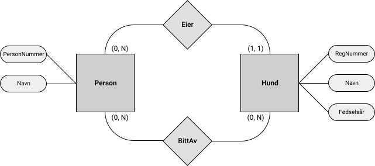

### Forekomstdiagram
Som mengder:
$$
\begin{align*}
    \text{Person} &= \{A, B, C, D\} \\
    \text{Hund} &= \{1, 2, 3\} \\
    \text{Eier} &= \{(B, 1), (D, 3), (C, 2)\} \\
    \text{BittAv} &= \{(D, 1), (C, 2), (A, 2)\}
\end{align*}
$$
Som forekomstdiagram:


### Oppgave: Enkel fotodatabase
1. Entitetsklasser
   - Fotografi
   - Fotograf
   - Motiv
2. Attributter for entiteter
   - Fotografi
     - identifikator
     - tittel
     - dato
   - Fotograf
     - identifikator
     - navn
     - nasjonalitet
   - Motiv
     - identifikator
     - beskrivelse
3. Relasjonsklasser
   - Fotograf har tatt et fotografi
   - Et fotografi viser et motiv
4. ?
5. ?
6. Restriksjoner
   - Fotograf (0, N) harTatt (0, 1) fotografi
   - Fotografi (0, N) viser (0, N) motiv

ER-diagrammet blir da som følger:


## Video-2-ER-rekursive-relasjonsklasser
- Rekursiver relasjonsklasser er relasjonsklasser der samme entitetsklasse inngår flere ganger.
- En entitetsklasse kan ha flere roller i relasjonsklassen.


#### Oppgave
Ta utgangspunkt i Emne-Student-modellen:


1. Du skal utvide modellen slik at vi kan registrere hvilke emner som anbefales som forkunnskaper for et emne.
2. Tegn et forekomstdiagram med utgangspunkt i følgende tabell

Emne | Bygger på
---  | ---
TDT4100 | TDT4110
TDT4120 | TDT4100
TDT4145 | TDT4100
TDT4145 | TDT4120

##### Løsning:
1.

2.


## Video-3-ER-svake-entitetsklasser
- En entitetsklasse er en mengde entiteter
  - Vi kan altså ikke ha to like entiteter i en entitetsklasse
  - Alle entiteter må ha en unik identifikator (nøkkelattributt)
  - Eksempel:
    - Kommuner har et unikt KommuneNr og et kommunenavn
    - Kommuner har gater som har unike gatenavn innenfor kommunen
    - **Problem(!)**: entitetsklassen Gate har ingen (naturlig) nøkkel


- En entitetsklasse som mangler en naturlig nøkkel, kan av og til identifiseres gjennom en *identifiserende relasjonsklasse* til en annen (identifiserende) entitetsklasse. Dette kalles en *svak entitetsklasse* (siden den mangler en nøkkel)
  - Den må være eksistensavhengig av deltakelse i den identifiserende relasjonsklassen
  - Den må ha ett eller flere attributt som identifiserer entiteter unikt sammen med nøkkelen til den identifiserende entitetsklassen
- Fordelen er at vi unngår å legge til et "unødvendig" nøkkelattributt
- **Løsning** på problemet over:


#### Oppgave
Ta utgangspunkt i Emne-Student-modellen:


- Du skal utvide modellen slik at vi kan holde oversikt over alle eksamener som er arrangert i et emne. Et emne har maks en eksamen på en bestemt dato. Ulike emner kan ha eksamen på samme dag. En student kan ha tatt flere eksamener i et og samme emne, i så fall skal vi kunne lagre oppnådd karakter på hver av disse eksamenene.

##### Løsning


## Video-4-EER-spesialisering

### Enhanced ER (EER)
- Standard ER, pluss
  - Støtte for spesialisering/generalisering
    - Subklasser/superklasser
  - Entitetsklasser med entiteter fra ulike entitetsklasser
    - Kategorier (union-typer)
  - Arv
    - Relasjonsklasser og attributter
- Pensum
  - Spesialisering/generalisering: 4.1-4.3
  - Kategorier: 4.4

### Spesialisering/generalisering
- Spesialisering
  - Å definere en mengde subklasser (underklasser) for en entitetsklasse (superklasse)
- Generalisering
  - Samling av entitetsklasser med felles egenskaper som subklasser under en (felles) superklasse (overklasse)
- De felles egenskapene modelleres på superklassen
- Det som er unikt for en subklasse, modelleres på subklassen

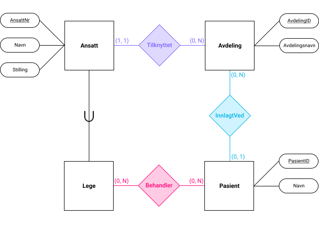
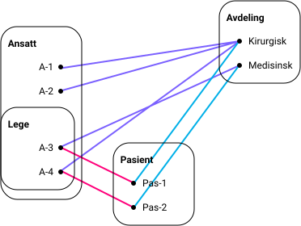

### Notasjon m.m.
- En entitet i en subklasse er alltid en entitet i superklassen
  - Men har en spesiell rolle
- Entiteter i subklasser arver alle superklassens attributter og relasjoner
- Subklassene kan ha egne
  - Attributter
  - Relasjonsklasser
- Entiteter må generelt ikke være med i en subklasse, men det kan være et krav
- En entitet kan være med i bare en subklasse, eller den kan være med i flere

### Restriksjoner (1)
- Regelbasert eller brukerstyrt deltakelse i subklasse

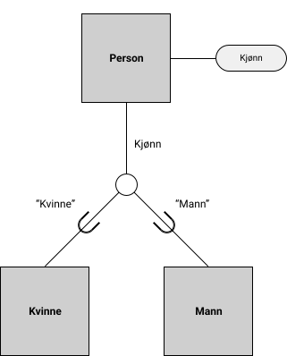

### Restriksjoner (2)
- Disjunkte eller overlappende subklasser
  - Hvorvidt en entitet kan være i flere subklasser samtidig
- Delvis eller total spesialisering (frivillig eller tvungen)
  - Total/tvungen vil si at alle entiteter i superklassen må også være i minst en subklasse

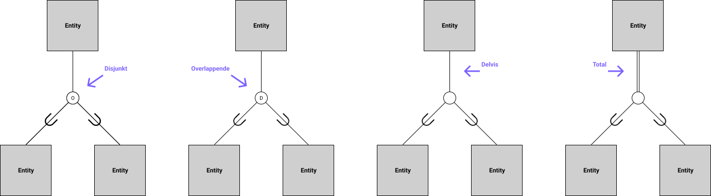

### Restriksjoner (4)
Entitet deltar i | disjunkt | overlappende
--- | --- | ---
delvis | 0-1 subklasser | 0-n subklasser
total | 1 subklasse | 1-n subklasser

### Oppgave: Idrettslag
Idrettslag kan ha avdelinger som fotball eller håndball. Idrettslag har medlemmer som kan være tilknyttet en eller flere avdelinger. En avdeling kan organisere en eller flere treningsgrupper. Alle personer som har en rolle i et idrettslag eller deltar i aktiviteter i laget må være medlem. En person kan være medlem i flere idrettslag. Hver treningsgruppe må ha en ansvarlig leder, kan ha et antall deltakende utøvere og kan ha en eller flere trenere. Det finnes et antall trenerkurs. Hvis en trener har tatt et kurs skal dette være registrert. Hver avdeling kan ha et antall ledere i ulike lederroller. Den som leder en treningsgruppe må ha en lederrolle i avdelingen som organiserer treningsgruppen. Medlemmer kan ha ulike roller, for eksempel være både leder, trener og utøver.

#### Løsning
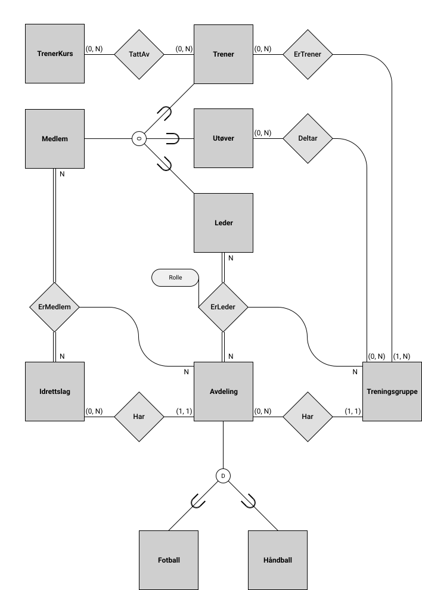
NB: mistanke om at relasjonene av tredje grad er feil!


## Video-5-EER-kategorier

### Kategorier: Subklasser med flere superklasser
- Mengden entiteter i en kategori er en delmengde av entitetene i superklassen
- Kategorier kalles også union-klasse, derfor U i sirkelen
- Selektiv arv

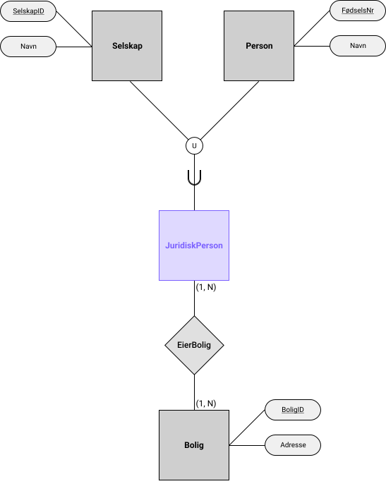

### Restriksjoner: Delvis/total
- På samme måte som ved spesialisering/generalisering

### Total kategori eller superklasse?
- Når alle entiteter i superklassene for en kategori må delta i kategorien bør vi vurdere om en løsning med spesialisering/generalisering blir bedre

### Oppgave: Bildedatabase hos Politiet
Påloitiet har en bildedatabase der bilder har id, tittel og dato. For hvert bilde ønsker man å kunne registrere interessante objekter som vises i bildet. Dette kan være personer (person-ID, navn), kjøretøy (registreringsnummer, merke og modell) eller andre fysiske objekter (objekt-ID, objektnavn, beskrivelse) som en koffert eller en pistol. Et bilde kan ha mange interessante objekter og et objekt kan være avbildet i mange bilder. Når et objekt er avbildet i et bilde skal man kunne registrere objektets plassering (horisontal% og vertikal%) Objektets interesse i bildet spesifiseres på en skala fra 1-5, der 5 angir høy interesse. 

#### Løsning
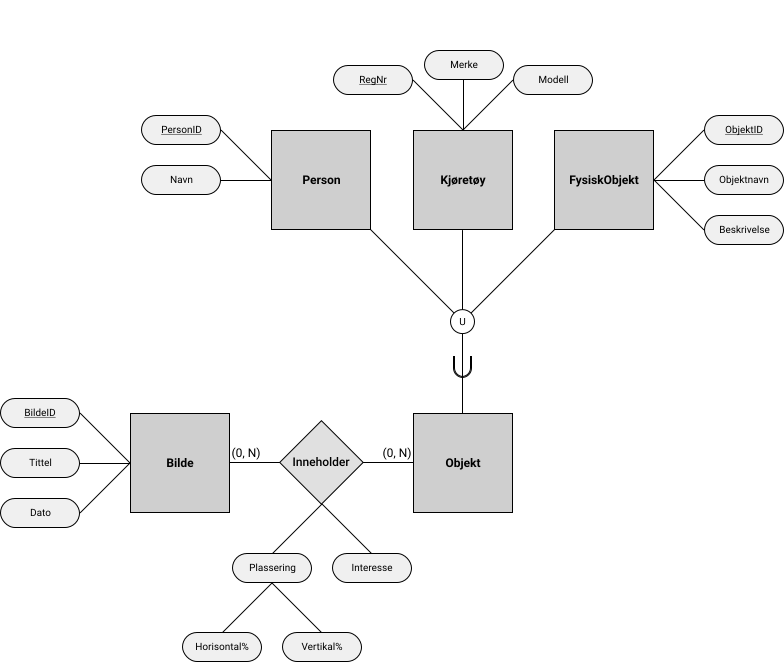


## Video-6-relasjonsdatabaser-intro

### Relasjonsdatabaser - oversikt
- Modell, kap. 1
- Oversetting fra ER, kap. 9
- Relasjonsalgebra, kap. 8
- SQL, kap. 6-7
- MySQL

### Relasjonsdatabaser (1): Tabeller / Relasjoner


### Relasjonsdatabaser (2)
- Skjema ("intention") beskriver tabellen
  - Tabellnavn
  - Kolonner (attributter)
  - Kolonnenes datatyper
  - Restriksjoner
    - Primærnøkkel (entydig identifikator) og andre restriksjoner
- Forkomst av data ("extension")
  - Rader/tupler med lovlige verdier
- Spesiell NULL-verdi
  - Der vi ikke har noen verdi
- Fremmednøkkel
  - Verdi som viser til en rad (tuppel) i en annen tabell (ev. samme tabell)

### Hundedatabasen: skjema


Person
PersonNummer | Navn
--- | ---

Hund
RegNummer | Navn | Fødselsår | EierPersonNummer
--- | --- | --- | ---

BittAv
OfferPersonNummer | HundRegNummer | Antall
--- | --- | ---

- EierPersonNummer er en fremmednøkkel mot Person (PersonNummer)
- OfferPersonNummer er en fremmednøkkel mot Person (PersonNummer)
- HundRegNummer er en fremmednøkkel mot Hund (RegNummer)

### Hundedatabsen: innhold
Person
PersonNummer | Navn
--- | ---
1 | Ola
2 | Karl
3 | Per
4 | Liv

Hund
RegNummer | Navn | Fødselsår | EierPersonNummer
--- | --- | --- | ---
1 | King | 2018 | 1
2 | Pluto | 2017 | 1
3 | Lady | NULL | 2

BittAv
OfferPersonNummer | HundRegNummer | Antall
--- | --- | ---
3 | 1 | 1
3 | 2 | 2
3 | 3 | 1
2 | 2 | NULL

### Relasjonsdatabaser (3)
- Standard relasjonsdatabaser har
  - Atomiske verdier i domenene (datatypene)
  - En verdi for hvert attributt (i en rad)
  - Dette gir oss "flate, 2-dimensjonale tabeller)
- Ikke-standard relasjonsdatabaser kan ha
  - Sammensatte attributter (poster, tabeller), repeterende grupper (fler-verdi-attributter)
- Entitetsintegritet
  - En relasjon (tabell) er en mengde tuppler (rader)
    - Kan ikke ha to like tuppler (rader)
  - Alle tabeller må ha en primærnøkkel (unik identifikator)
    - NULL tillattes ikke
- Referanseintegritet
  - Fremmednøkeler må referere til en tuppel som finnes i den tabellen det refereres til eller bare bestå av NULL-verdier

### Oppgave
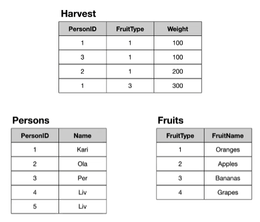

- Hvilke nøkler og fremmednøkler har vi i de tre tabellene?
  - PersonID (Persons) og FruitType (Fruits) er nøkler
  - PersonID (Harvest) og FruitType (Harvest) er fremmednøkler
- Hvem har plukket mest appelsiner?
  - Appelsiner har FruitType 1, vi ser i Harvest at personen med PersonID 2 har plukket mest (200 gram). Dette er Ola.
- Hvor mye epler er plukket til sammen?
  - Ingen epler er plukket.


## Video-7-relasjonsdatabaser-mapping-av-ER

### ER til RDB (1): Regulære entitetsklasser
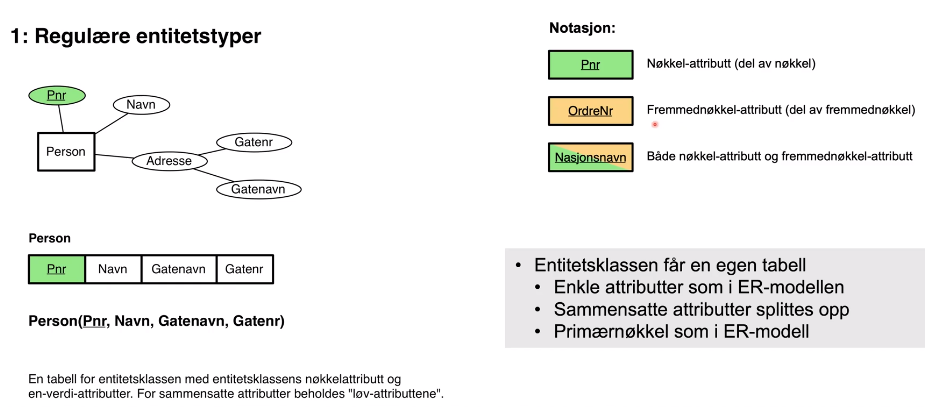

### ER til RDB (2): Svake entitetsklasser
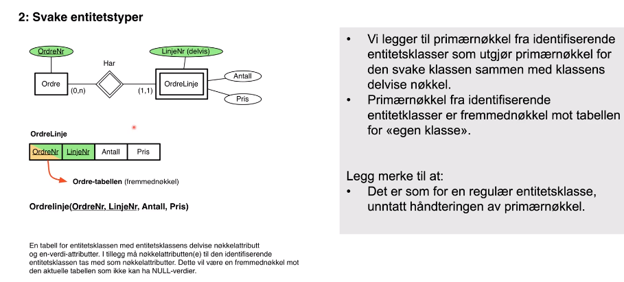

### ER til RDB (3): Binære 1:1 relasjonsklasser
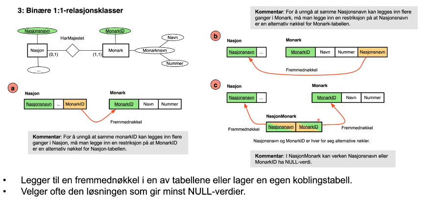

### ER til RDB (4): Binære 1:N relasjonsklasser
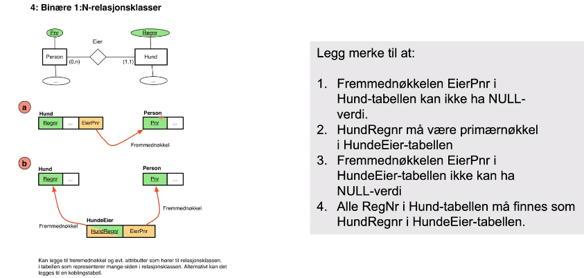

### ER til RDB (5): Binære N:M relasjonsklasser


### ER til RDB (6): Fler-verdi attributter
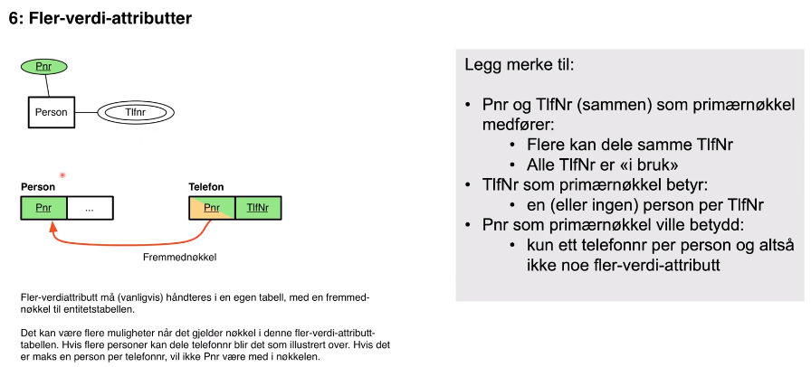

### ER til RDB (7): N-ære relasjonsklasser
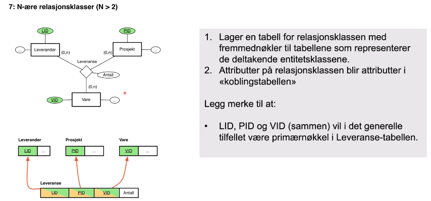

### Oppgave: mapping
Lag relasjonsskjema for følgende ER-diagram


Fotograf
**Identifikator** | Navn | Nasjonalitet
--- | --- | ---

Fotografi
**Identifikator** | Tittel | Dato | FotografId

FotografId er fremmednøkkel mot Fotograf

Motiv
**Identifikator** | Beskrivelse

HarMotiv
FotografiId | MotivId
--- | ---

FotografiId er fremmednøkkel mot Fotografi og MotivId er fremmednøkkel mot Motiv


## Video-8-relasjonsdatabaser-mapping-av-EER

### ER til RDB (8): spesialisering/generalisering
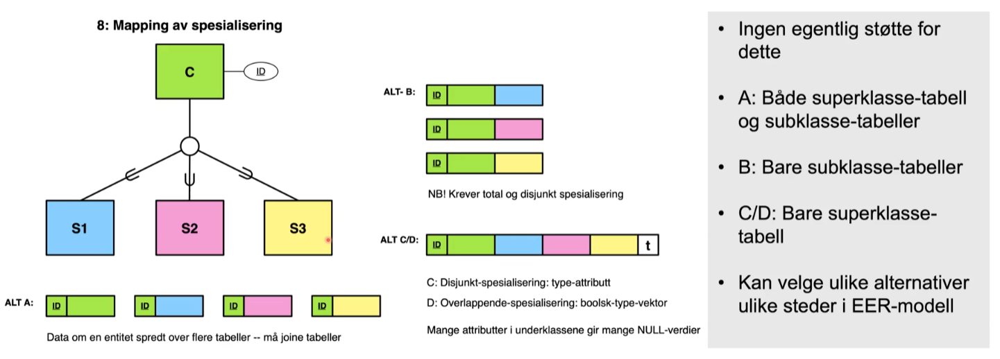

### ER til RDB (9): kategorier
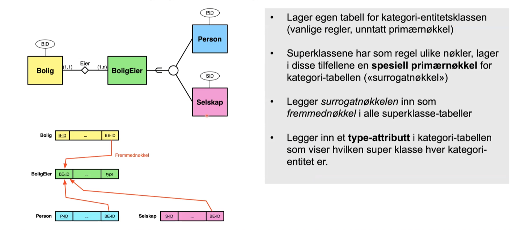

### Oppgave: spesialisering/generalisering
Oversett følgende til RDB-skjema
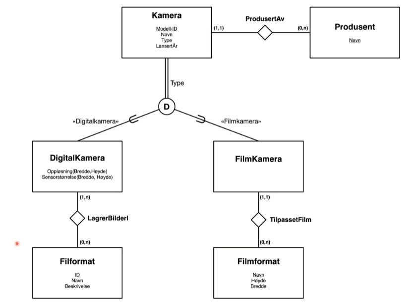

### Oppgave: kategorier
Oversett følgende til RDB-skjema
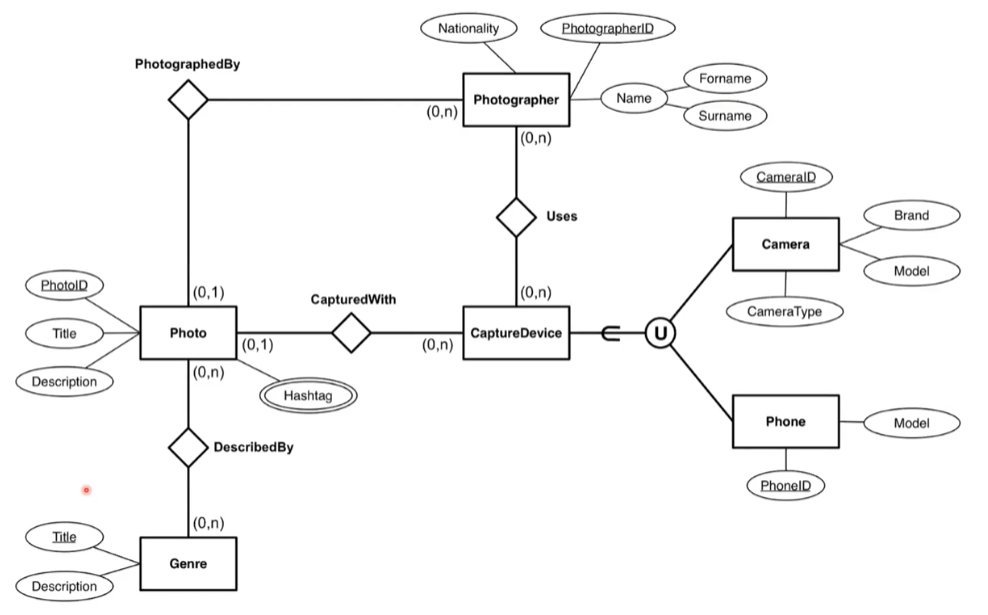

Photographer
**PhotographerID** | Nationality | FirstName | Surname
--- | --- | --- | ---

Photo
**PhotoID** | Title | Description | PhotographedBy | CapturedWith
--- | --- | --- | --- | ---

Hashtag
**PhotoID** | Hashtag
--- | ---

Genre
**Title** | Description
--- | ---

DescribedBy
**PhotoID** | **GenreTitle**
--- | ---

CaptureDevice
**CDID** | Type
--- | ---

Camera
CDID | **CameraID** | Model | Brand | CameraType
--- | --- | --- | --- 

Phone
CDID | **PhoneID** | Model
--- | --- | --- 

Uses
**PhotographerID** | **CDID**
--- | ---


## Video-9-relasjonsdatabaser-relasjonsalgrebra-del-1

### Relasjonsalgebra
- Operatorer for å manipulere tabeller:
  - Vi ser kun på spørrefunksjonalitet, ikke innsetting, endring eller sletting
  - Viktig grunnlag for å forstå hva man kan gjøre med tabeller, for normaliseringsteorien og for spørreoptimalisering og spørreutføring
- Husk: tabellforekomster er mengder av tuppler
- Operatorene er lukket over tabeller:
  - Operanden(e) er tabell(er), resultatet er en ny tabell
- Mengdeoperatorer:
  - Union, snitt, mengdedifferanse (minus), kartesisk produkt, ..
- Spesielle operatorer:
  - Seleksjon, projeksjon, join-operatorer, ..

### Projeksjon
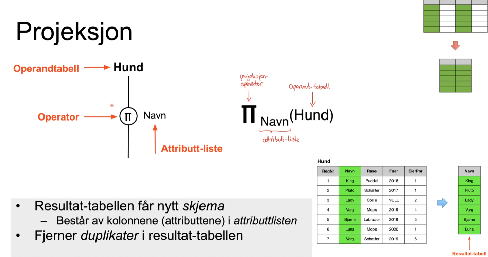

### Seleksjon
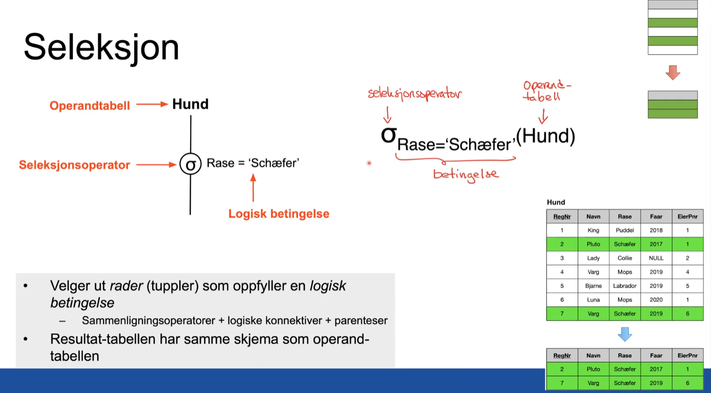

### Kan kombinere operatorer
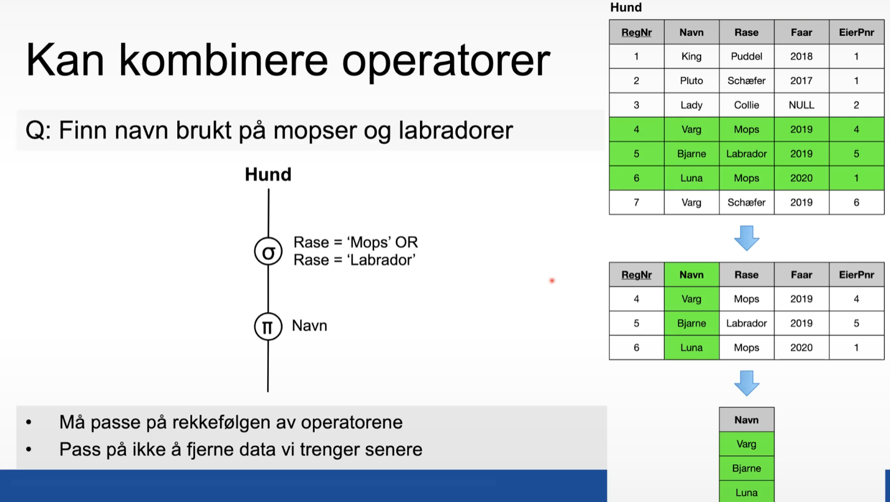

### Mengdeoperatorene: union, snitt of differanse
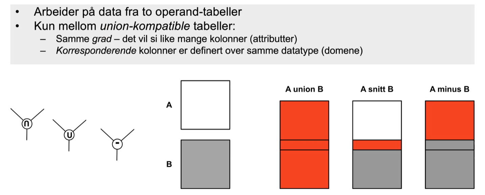

### Kartesisk produkt (X)
- Kombinerer alle tuppler (rader) i den ene tabellen med alle tuppler i den andre tabellen
- Resultattabellen får alle kolonner fra den første tabellen og alle kolonner fra den andre
  - Ved behov kan vi prefikse med tabellnavn
- To operand-tabeller med henholdsvis r og s tuppler, vil gi resultattabell med r*s tuppler
  - Kan lett gi svært store resultattabeller
- En ukritisk sammenstilling

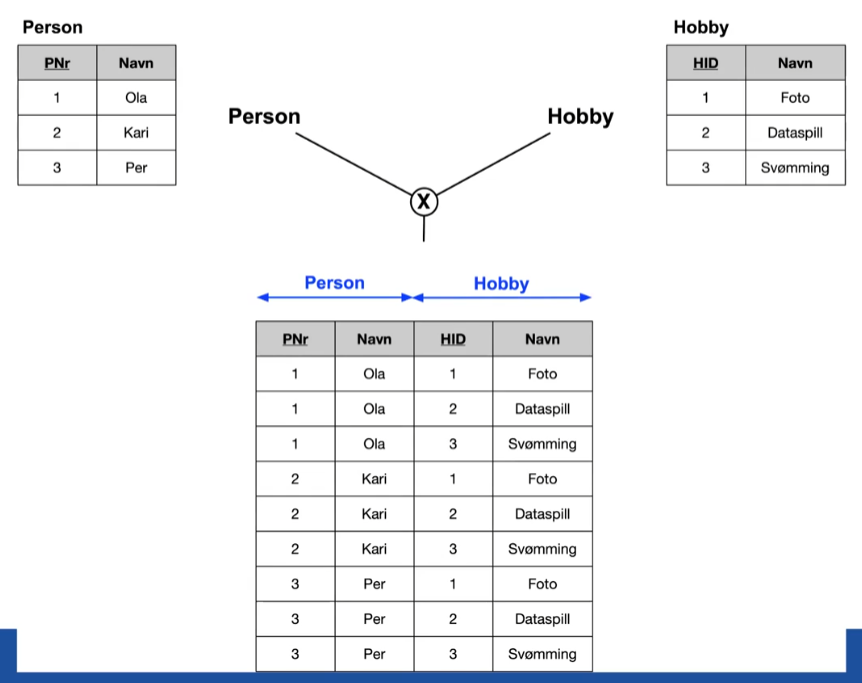

### Oppgaver
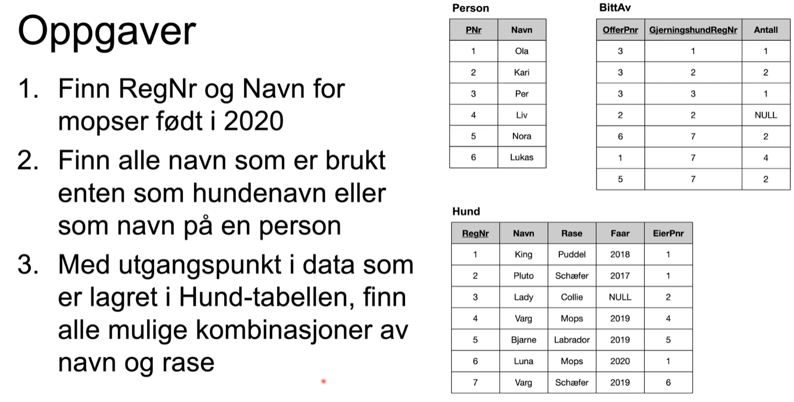

1. $\pi_{\text{Navn, RegNr}}(\sigma_{\text{Rase=Mops, FAar}=2020}(\text{Hund}))$

2. $\pi_{\text{Navn}}(\text{Person}) \cup \pi_{\text{Navn}}(\text{Hund})$

3. $\pi_{\text{Navn}}(\text{Hund}) \times \pi_{\text{Rase}}(\text{Hund})$


## Video-10-relasjonsdatabaser-relasjonsalgrebra-del-2

### JOIN - kritisk sammenstilling
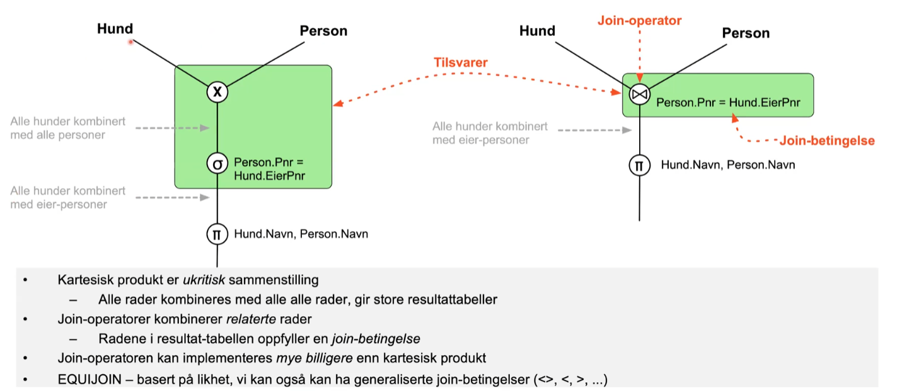

### Oppgaver
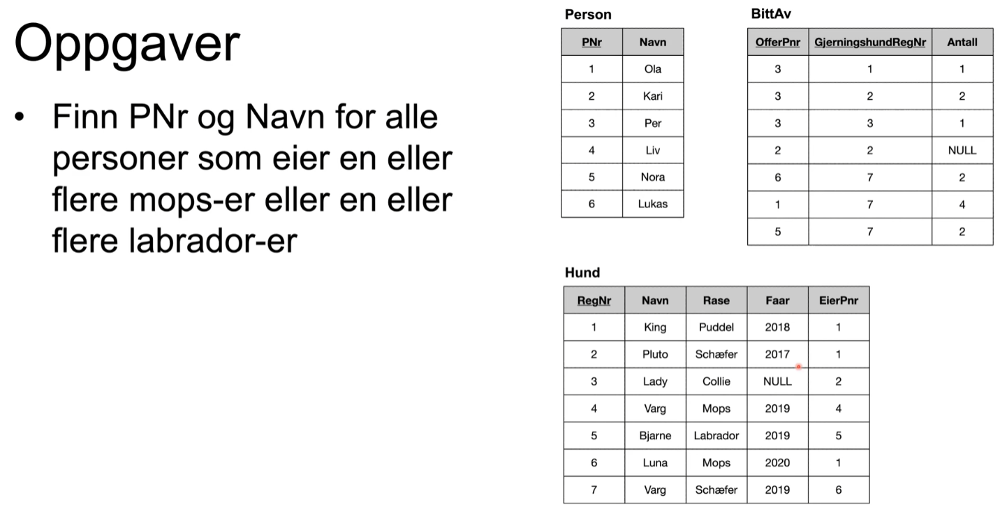

$\pi_{\text{Pnr, Navn}}(\Join_{\text{Pnr=EierPnr}}(\text{Person}, \sigma_{\text{Rase=Labrador OR Rase=Mops}}(\text{Hund})))$

## Video-11-relasjonsdatabaser-relasjonsalgrebra-del-3

### EQUIJOIN
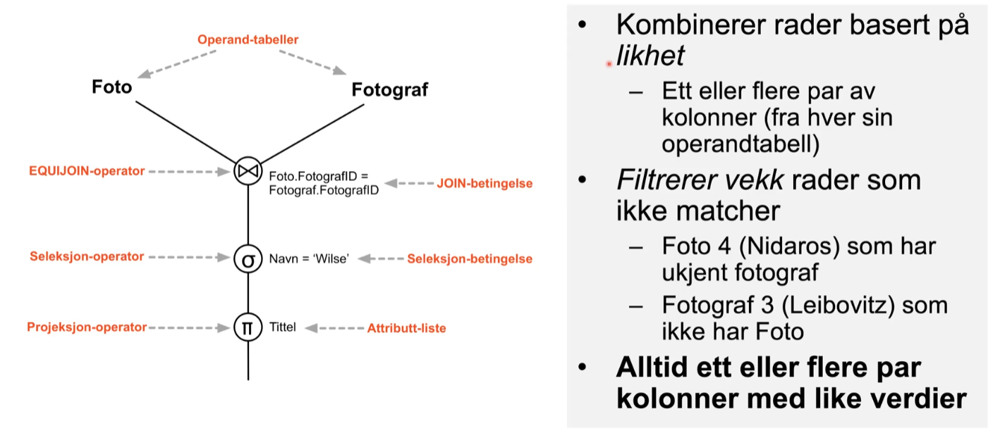

### Naturlig join (*)
- Som EQUIJOIN, men
  - \* som operatorsymbol
  - Implisitt join-betingelse
    - Likhet i alle par av kolonner me like navn
  - Fjerner alle "duplikatkolonner"
- Tilsvarer kartesisk produkt + seleksjon + projeksjon
- Risiko:
  - Kan bli større join-betingelse enn man ønsker
  - Ved endringer i operand-tabellene kan join-betingelsen endre seg

### Omdøping og sortering
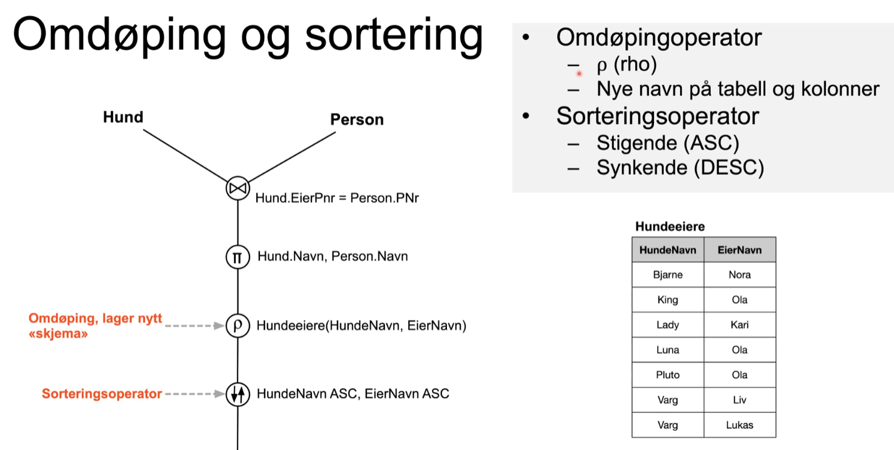

### Outer-join-operatorer
- Får med alle rader i en eller begge operand-tabellene
  - Left outer join: alle rader fra "venstre-operanden"
  - Right outer join: alle rader fra "høyre-operanden"
  - Full outer join: alle rader fra begge operander
- Filterer ikke bort rader slik som inner-join-operatorer
- Rader som mangler "matchende" rad i den andre tabellen kombineres med en rad der alle attributter er satt til NULL-verdi

### Oppgaver
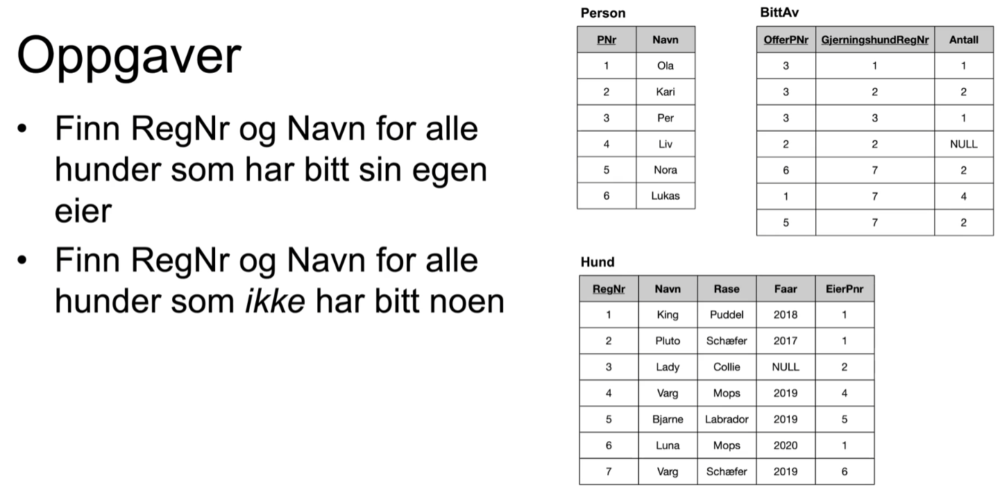

1. $\pi_{\text{Navn, RegNr}}(\sigma_{\text{EierPnr=OfferPnr}}(\Join_{\text{RegNr=GjHundRegNr}}(\text{Hund, BittAv})))$

2. $\pi_{\text{Navn, RegNr}}(\text{Hund}) - \pi_{\text{Navn, RegNr}}(\Join_{\text{GjHundRegNr}=\text{RegNr}}(\text{Hund, BittAv}))$

## Video-12-relasjonsdatabaser-relasjonsalgrebra-del-4

### Aggregering / gruppering
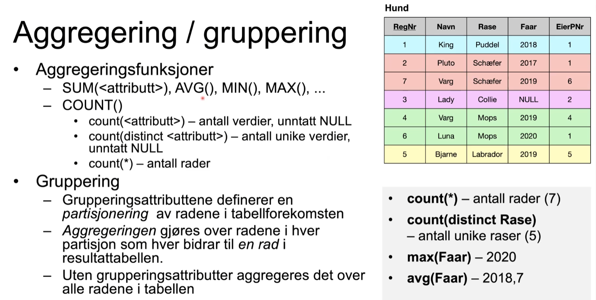

### Q: Antall hunder per rase
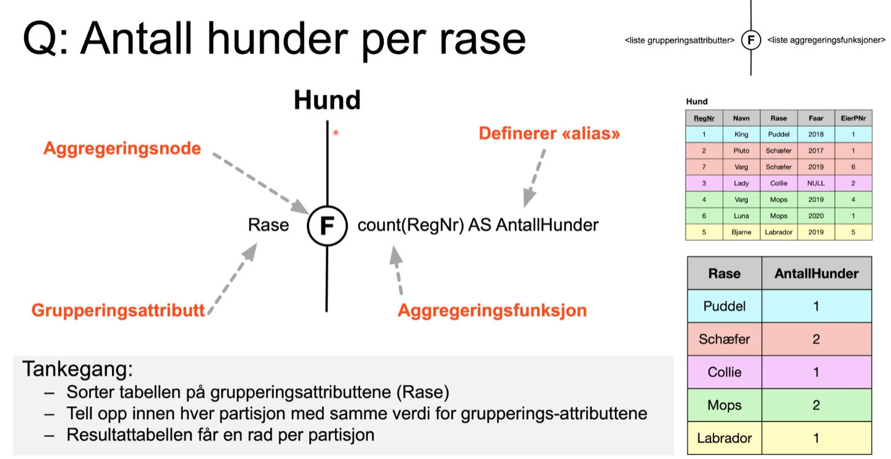

### Oppgave
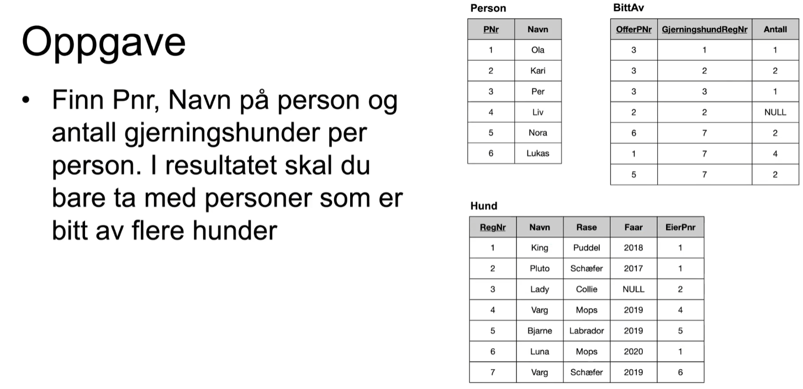

$\sigma_{\text{AntallHunder} > 1}(\text{F}_{\text{Pnr, Navn, COUNT(GjHundRegNr) AS AntallHunder}}(\Join_{\text{Pnr = OfferPnr}}(\text{Person, BittAv}))$

## Video-14-SQL

### SQL
- Opprinnelig fra IBM på 1970-tallet
- ANSI/ISO-standard
  - Omfattende
  - Produkttilpasninger (mangler, tillegg, varianter)
- Historiske alternativer
  - QUEL (fra Ingres)
  - QBE - Query By Example
- Ikke like mengdeorientert som relasjonsalgebra
  - Resultattabellene kan ha like rader/tuppler - må be om at duplikater fjernes
- Deklarativt spørrespråk ("hva, ikke hvordan")
  - Røtter i relational calulus (ikke pensum)
- Skiller ikke mellom små og store bokstaver i SQL reserverte ord ("keywords")
- Tips: SQL tutorial på w3schools: https://w3schools.com/sql/

### DDL - Data Definition 
```sql
create table /* opprette tabell */
alter table /* endre tabell */
drop table /* fjerne tabell */
```

### Hundedatabasen: Opprette tabell
```sql
CREATE TABLE Person (
  Pnr     INTEGER NOT NULL,
  Navn    VARCHAR(30),
  CONSTRAINT Person_PK PRIMARY KEY (Pnr));

CREATE TABLE Hund (
  Regnr   INTEGER NOT NULL,
  Navn    VARCHAR(30),
  Rase    VARCHAR(30),
  Faar    INTEGER,
  EierPnr INTEGER NOT NULL,
  CONSTRAINT Hund_PK PRIMARY KEY (Regnr),
  CONSTRAINT Hund_FK FOREIGN KEY (EierPnr) REFERENCES Person(Pnr)
    ON UPDATE CASCADE
    ON DELETE NO ACTION);

CREATE TABLE BittAv (
  Pnr     INTEGER NOT NULL,
  Regnr   INTEGER NOT NULL,
  Antall  INTEGER DEFAULT 0,
  CONSTRAINT BittAv_PK PRIMARY Key (Pnr, Regnr),
  CONSTRAINT BittAV_FK1 FOREIGN KEY (Pnr) REFERENCES Person(Pnr)
    ON UPDATE CASCADE
    ON DELETE CASCADE,
  CONSTRAINT BittAV_FK2 FOREIGN KEY (Regnr) REFERENCES Hund(Regnr)
    ON UPDATE CASCADE
    ON DELETE CASCADE);
```

### Foreign Key restriksjoner
```sql
CONSTRAINT Hund_FK FOREIGN KEY (EierPnr) REFERENCES Person(Pnr)
    ON UPDATE <>
    ON DELETE <>);
```
Alternativer for `<>`:
- `NO ACTION` (default) / `RESTRICT`: stopper handlingen
- `SET NULL`: setter `NULL`-verdi
- `CASCADE`: oppdaterer/sletter tilsvarende

### DML - Data Manipulation Language
- Endre data
  - `insert`
  - `update`
  - `delete`
- Spørringer
  - alt gjøres med `select`

### Hundedatabasen: sette inn data
```sql
INSERT INTO Person VALUES (1, 'Ola');
INSERT INTO Person VALUES (2, 'Kari');
INSERT INTO Person VALUES (3, 'Per');

INSERT INTO Hund VALUES (1, 'King', 'Puddel', 2018, 1);
INSERT INTO Hund VALUES (2, 'Pluto', 'Schæfer', 2017, 1);
INSERT INTO Hund VALUES (3, 'Lady', 'Collie', NULL, 2);

INSERT INTO BittAv VALUES (3, 1, 1);
INSERT INTO BittAv VALUES (3, 2, 2);
INSERT INTO BittAv VALUES (2, 2, NULL);
```

### Hundedatabasen: endre, slette og spørre
- update
```sql
update person
set Navn = 'Karianne'
where Pnr = 2
```
- delete
```sql
delete from Hund
where Navn = 'Varg'
```
- select
```sql
select Navn
from Hund
where Rase = 'Mops'
```

### DML: spørringer
- SELECT-setningen
  - Ikke samme som seleksjon!
```sql
SELECT <attributt-liste>
FROM <tabell-liste>
WHERE <logisk betingelse>
```
- Spesifiserer
  - "Skjema" for resultattabellen
  - Hvilke tabeller som er involvert og sammenstillingen av disse
  - En betingelse som alle rader i resultat-tabellen må oppfylle
- SQL eliminerer ikke duplikater (bag-semantikk)
- Setningen kan bygges ut med flere deler

$\pi_{\text{<attributt-liste>}}(\sigma_{\text{<logisk betingelse>}}(\text{<tabell>}))$

### Oppgave

- Finn RegNr, Navn og Rase for alle hunder som er eid av Ola (Pnr=1), eller Kari (Pnr=2)
  
```sql
SELECT RegNr, Navn, Rase
FROM Hund
WHERE (EierPnr = 1) OR (EierPnr = 2)
```

## Video-15-SQL

### Distinkte elementer
- `DISTINCT` rett etter `SELECT` fjerner duplikater
  - Ingen like rader i resultattabellen
- Eksempel:
```sql
SELECT DISTINCT Navn
FROM Hund
```

### Ordning av resultat-tabell
- `ORDER BY` < attributt-ordning-liste >
  - ASC - ascending, DESC - descending
  - Alltid til slutt i `SELECT`-setning
- Eksempel:
```sql
SELECT DISTINCT Navn
FROM Hund
ORDER BY Rase ASC
```

### Betingelser på tekstfelt
- Rase = 'Puddel' sjekker 100% likhet
- LIKE kan lage betingelser med "wildcards"
  - % = 0-n tegn
  - _ = 1 tegn
- Eksempel: Pnr og Navn for personer som har navn som begynner med L
```sql
SELECT * -- * angir alle kolonner
FROM Person
WHERE Navn LIKE 'L%'
```

### Data fra flere tabeller: "Klassisk" SQL
- Eksempel: RegNr, Hundens navn og eiers navn
```sql
SELECT RegNr, Hund.Navn AS Hundenavn
  Person.Navn AS Eier
FROM Hund, Person
WHERE Hund.EierPnr = Person.Pnr
```
- Hund.EierPnr = Person.Pnr er en join-betingelse
- Uten join-betingelsen vil vi få kartesisk produkt mellom Hund- og Person-tabellene
- AS Hundenavn definerer et "alias" for attributtet

### Data fra flere tabeller: Moderne SQL
- Spesifiserer sammenstillingen i FROM-delen:
  - JOIN typer
    - JOIN / INNER JOIN
    - NATURAL JOIN
    - LEFT OUTER JOIN, RIGHT OUTER JOIN, FULL OTHER JOIN
    - CROSS JOIN (kartesisk produkt)
  - JOIN betingelse (condition)
    - NATURAL
    - ON < logisk betingelse >
    - USING ( < attributt-liste > )
- Fordeler
  - Kan ha ulike typer sammenstillinger
  - Bruker FROM-delen til å definere "data-grunnlaget" for spørringen
- Eksempel:
```sql
SELECT RegNr, Hund.Navn, AS Hundenavn,
  Person.Navn AS Eier
FROM Hund INNER JOIN Person ON
  Hund.EierPnr = Person.Pnr
```
- Eksempel: RegNr og Navn for schæfere som har bitt noen
```sql
-- Spørring med ON
SELECT Hund.RegNr, Navn
FROM Hund INNER JOIN BittAv ON
  Hund.RegNr = BittAv.RegNr
WHERE Rase = 'Schæfer'

-- Alternativ med NATURAL
SELECT Hund.RegNr, Navn
FROM Hund NATURAL INNER JOIN BittAv
WHERE Rase = 'Schæfer'

-- Spørring med USING
SELECT Hund.RegNr, Navn
FROM Hund INNER JOIN BittAv USING RegNr
WHERE Rase = 'Schæfer'
```

### Oppgaver
1. Finn RegNr, hundens Navn, eiers Pnr, og eiers Navn for hunder som har bitt sin egen eier
```sql
SELECT Hund.Regnr, Hund.Navn, Person.Pnr, Person.Navn
FROM (Hund INNER JOIN BittAv USING (Regnr))
  INNER JOIN Person ON (Hund.EierPnr = Person.Pnr)
WHERE BittAv.Pnr = Hund.EierPnr
```
2. Finn alle mulige kombinasjoner av hundenavn og raser
```sql
SELECT H1.Navn, H2.Rase
FROM Hund as H1 CROSS JOIN Hund as H2
```


## Video-16-SQL

### Innebygde funksjoner
- `COUNT`, `SUM`, `MIN`, `MAX`, etc.
- Funksjonene ignorerer `NULL`-verdier
- `COUNT(*)` teller antall rader (uansett `NULL`-verdier)
- `DISTINCT` gjør at funksjonene opererer på unike verdier
- Eksempel: Finn antall hunder og antall ulike raser
```sql
SELECT COUNT(*) AS AntallHunder,
  COUNT(DISTINCT Rase) AS AntallRaser
FROM Hund
```
- Kan ha aritmetosle uttrykk som operand
- Eksempel: Finn gjennomsnittsalder for hunder
```sql
SELECT AVG(2022 - FAar) AS SnittAlder
FROM Hund
```

### Gruppering
- `GROUP BY` < attributt-liste >
  - Definerer "grupper" (partisjoner) av rader
  - Må komme etter `WHERE`-del (ev. `FROM`-del)
```sql
SELECT EierPnr, COUNT(RegNr) AS AntallHunder
FROM Hund
GROUP BY EierPnr
ORDER BY AntallHunder DESC
```
- Algebraekvivalent:
$\text{SORT}_{\text{AntallHunder, DESC}}(\text{F}_{\text{EierPnr, COUNT(RegNr) AS AntallHunder}}(Hund))$

### Betingelse etter gruppering
- `HAVING` < betingelse >
  - Betingelse knyttet til resultatet av "opptelling" i gruppene
- Eksempel: RegNr, Navn, antall offer og sum av Antall-attributtet for hunder som har bitt flere enn to personer
```sql
SELECT H.RegNr, Navn, COUNT(*) AS AntallOffer
  SUM(Antall) As Antall
FROM Hund AS H INNER JOIN BittAv USING RegNr
GROUP BY H.RegNr, Navn
HAVING AntallOffer > 2
ORDER BY AntallOffer DESC, Antall DESC
```
- Betingelse i `WHERE`-delen fjerner rader før gruppering

### Nøstede spørringer (sammenligning, ANY, ALL)
- Sammenligningsoperatorer: `=, <>, <, <=, >, >=`
- Eksempel: Finn RegNr og Navn for de eldste hundene
```sql
SELECT RegNr, Navn
FROM Hund
WHERE FAar = (SELECT MIN (FAar) FROM HUND)
```
- Med ANY/ALL:
```sql
SELECT RegNr, Navn
FROM Hund
WHERE FAar <= ALL (SELECT FAar FROM HUND)
```
- `ALL`: sammenligningen må være oppfylt for alle verdier fra sub-spørringen
- `ANY`: sammenligningen må være oppfylt for minst en verdi fra sub-spørringen

### Nøstede spørringer (IN)
- Mengdeoperatoren 'element i':
  - `IN` / `NOT IN`
- Eksempel: Alle hunder som ikke har bitt noen:
```sql
SELECT *
FROM Hund
WHERE RegNr NOT IN (SELECT RegNr FROM BittAv)
```

### Nøstede spørringer (EXISTS)
- Gir del-spørringen resultat (minst en rad) eller ikke?
  - `EXISTS` / `NOT EXISTS`
- Eksempel: Hunder som ikke har bitt sin eier
```sql
SELECT *
FROM Hund AS H
WHERE NOT EXISTS (
  SELECT *
  FROM BittAv AS BA
  WHERE BA.RegNr = H.RegNr
    AND BA.Pnr = H.EierNr
)
```
- Dette er en korrelert del-spørring (sender inn data)

### Mengde-operatorer
- Mengdeorientert (fjerner duplikater)
  - `UNION` (union)
  - `INTERSECT` (snitt)
  - `EXCEPT` (minus)
- Bag-orienterte (multiset)
  - `UNION ALL`
  - `INTERSECT ALL`
  - `EXCEPT ALL`
- Husk union-kompatible (operand-)tabeller
- Her er det mye mangelfull og varierende implementasjon
  - Må ofte finne alternativer ved å nøste spørringer

### Nøstede spørringer i FROM-delen
- Lager en midlertidig tabell
- Eksempel: Finn hunder (RegNr, Navn, AntallOffer) som har bitt flere enn to personer og har et navn som også er brukt som navn på person
```sql
SELECT RegNr, Navn, AntallOffer
FROM (
  SELECT H.RegNr, Navn, COUNT(*) AS AntallOffer
  FROM Hund AS H INNER JOIN BittAv AS BA
  ON (H.RegNr = BA.RegNr)
  GROUP BY H.RegNr, Navn
) AS GjerningsHunder(RegNr, Navn, AntallOffer)
WHERE AntallOffer > 2 AND
  Navn = ANY (SELECT Navn FROM Person) -- Her kunne vi brukt IN
```

### VIEWS / Virtuelle tabeller
- View er tabeller som er avledet ut fra tabeller som er lagret i databasen
```sql
CREATE VIEW Hundeeier(Pnr, Navn, Hund)
AS SELECT Pnr, P.Navn, H.Navn
  FROM Person AS P INNER JOIN Hund AS H 
  ON (P.Pnr = H.EierPnr)
```
- Hvorfor: Spørreforenkling + sikkerhet + ytelse
- Implementasjon
  - query modification (skriver om spørringen)
  - view materialization (lagret view-et)
- Brukes som base-tabeller, men ikke alltid mulig å oppdatere gjennom VIEW
  - Sammenstilling fra flere tabeller / aggregering gir utfordringer

### Oppgaver
1. Finn alle kombinasjoner av hundenavn og rase som ikke er i bruk
```sql
SELECT H1.Navn, H2.Rase
FROM Hund as H1 CROSS JOIN Hund as H2

EXCEPT

SELECT Navn, Rase
FROM Hund
```

2. Finn Pnr og Navn for personer som ikke eier hunder
```sql
SELECT Pnr, Navn
FROM Person
WHERE Pnr NOT IN (
  SELECT EierPnr
  FROM Hund
)
```


3. Finn antall offer for hver hunderase. Alle hunderaser skal være med i resultatet

```sql
SELECT Rase, COUNT(*) AS AntallOffer
FROM Hund LEFT OUTER JOIN BittAv Using RegNr
GROUP BY Rase
```


</details>


<details open>
  <summary
    style="font-size: x-large"
  >Treningsoppgaver</summary>

## Treningsoppgave 1

### 1 Relasjonsklasser og restriksjoner
Ta utgangspunkt i en eller flere miniverdener som du kjenner godt. Finn eksempler på (binære) relasjonsklasser som har følgende restriksjoner, uttrykt med min-maks-par:
- (0,n) og (0,n)
- (0,1) og (0,n)
- (1,1) og (0,n)
- (1,1) og (1,n)

##### Løsning


### 2 Modelleringsoppgave

#### a) Utgangspunkt
Databasefaget har et antall studenter som tar faget og et antall øvinger som disse  studentene må gjøre før eksamen. Vi trenger en database for å holde oversikt  over studenter og øvinger. Finn ut hvilke opplysninger som det i denne  sammenhengen er nødvendig å ha om studenter. Alle øvinger har et entydig  øvingsnummer, en tittel, en oppgavetekst (URL til PDF-fil), et løsningsforslag  (URL til PDF-fil) og en innleveringsfrist. Vi ønsker å registrerer godkjenningsdato når en student får godkjent en bestemt øving. Lag et ER-diagram for en slik database.

##### Løsning
- Entiteter
  - Student
    - StudentNr
  - Øvinger
    - ØvingsNr
    - Tittel
    - OppgaveTekst
    - LF
    - Frist
- Relasjoner
  - Student (0,N) --- FåttGodkjent --- (0,N) Øving
    - Dato


#### b) Nye krav
Etter litt bruk av databasen finner vi ut at vi trenger litt utvidet funksjonalitet. Vi ønsker å holde oversikt over øvingsassistentene (stud.ass.-er og und.ass-er) i faget. Den nødvendige informasjonen er ansattnummer som er unikt for hver person, navn, e-postadresse og mobiltelefonnummer. Det er bare øvingsassistenter som kan godkjenne øvinger. Når en øving blir godkjent ønsker vi å registrere hvem som har godkjent den, i tillegg til godkjenningsdato. Hver student skal registreres med en primærassistent, men kan få godkjent øvinger av alle assistenter. Lag et utvidet ER-diagram som oppfyller de nye kravene til databasen.

##### Løsning
- Entiteter
  - Student
    - StudentNr
  - Øvinger
    - ØvingsNr
    - Tittel
    - OppgaveTekst
    - LF
    - Frist
  - Øvingsassistent
    - AnsattNr
    - Navn
    - E-post
    - Tlf
- Relasjoner
  - Student (0,N) --- FåttGodkjent --- (0,N) Øving
    - Dato


#### c) Nye krav II
Vi ønsker å samle kvalitetsdata om øvingene og studentenes innsats med disse. Når en øvingsassistent godkjenner en øving skal hun, i tillegg til dato, registrere en poengsum fra 0-100 som viser i hvilken grad studenten har oppnådd målene for øvingen. Studentene skal også kunne gi vurdering av øvinger, med ”terningkast” fra 1-6. Lag et utvidet ER-diagram som oppfyller de nye kravene til databasen.

##### Løsning


#### d) Forekomstdiagram
Anta en databasetilstand der vi har 3 øvinger (ø-1, ø-2 og ø-3), 3 studenter (s-1, s-2 og s-3) og 2 øvingsassistenter (a-1 og a-2). s-1 har gjort ø-1 og ø-2, godkjent av a-1. s-2 har gjort øving ø-1 som ble godkjent av a-1, og øving ø-3 som ble godkjent av a-2. s-1 har vurdert de to godkjente øvingene til terningkast 4. Alle studentene har a-1 som primærassistent. Tegn et forekomstdiagram for denne databasetilstanden. Gjør de forutsetningene som du evt. trenger.

##### Løsning
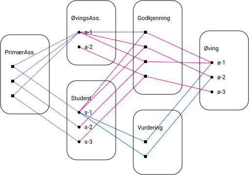

</details>